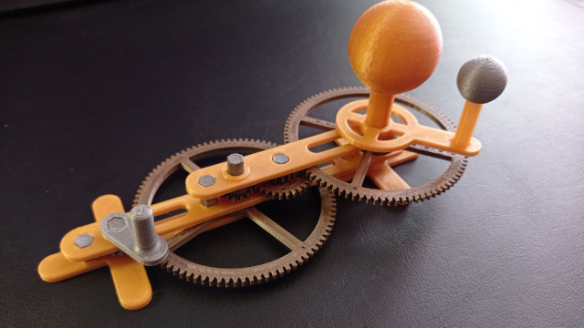
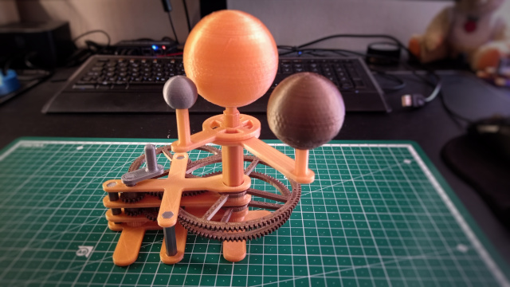
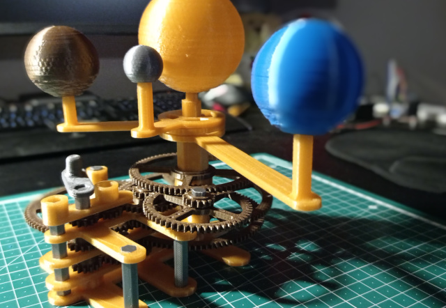
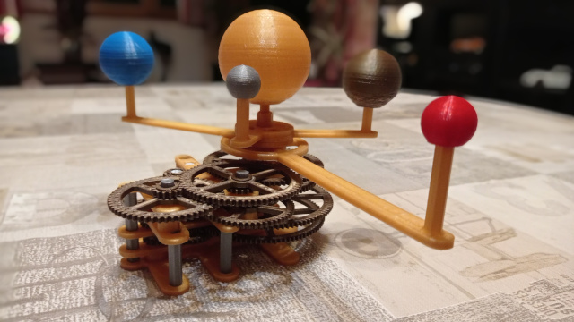

# planétaire


Ce projet consiste à réaliser un planétaire mécanique à l'échelle d'un bureau, à base d'impression 3D et d'électronique (Raspberry pico)

## cadrage du projet 

Quelques bases concernant [les dimensions](https://www.papsdroid.fr/post/planetaire) du système solaire

Notre planétaire mécanique à l'échelle d'un bureau va:
* représenter les orbites sous forme de cercles
* tricher sur les proportions des orbites et taille de Jupiter et Saturne (et du soleil)
* intégrer les 6 planètes visibles à l’œil nu: Mercure, Vénus, la Terre (et son satellite la lune), Mars, Jupiter et Saturne.

Un peu de théorie avec [les engrenages](https://www.papsdroid.fr/post/planetaire-engrenages)
* les roues dentées utlisées doivent être limitées en nombre de dents (de 13 à 100)
* les engrenages simples (2 roues dentées) ne permettent pas d'obtenir de gros rapport de réduction R = -d1/d2 (avec 2 roues) ou R = +d1/d3 (avec 3 roues: le nombre de dents de la roue intermédiaire ne compte pas dans le rapport de réduction)
* les engrenages à étage permettent d'aller chercher les gros rapports de réduction selon l'équation:

```python
R = (-1)^y * (Z1 * Z2 *..* Zn) / (D1 * D2 * ... * Dm)
```

* y est le nombre de contacts entre les dents.
* Zi, Dj le nombre de dents d'une roue.
* n le nombre de roue menantes.
* m le nombre de roue menées.


## calcul des réduction d'engrenages 

le programme **engrenage_reduction.py** (dossier /python) calcule la meilleure solution d'engenages sur 2, 3 ou 4 étages pour obtenir un rapport de réduction R donné. Plus de détail dans [cet article](https://www.papsdroid.fr/post/planetaire-calcul-engrenages).

## Conception des étages d'engrenages par planète

### Mercure
La conception du prototype en 3D est expliquée [ici](https://www.papsdroid.fr/post/mercure)



Ce premier prototype utilise un mécanismue de réduction 1/7 avec une roue de 13 dents contre une roue de 13*7=91 dents afin d'avoir un premier axe qui représente une jounée (celui où l'on retrouve la manivelle) et un second qui représente une semaine. Tous les mécanismes vont partir de l'axe des semaines, les rapports sont donc tous réduits par 7 dès le départ.

Mercure tourne autour du soleil en 87,969 jours ( =12,567 semaines). En utilisant des roues menantes de 14  et 15 dents contre des roues menées de 29 et 91 dents j'obtiens un rapport de réduction de 87,967.


### Vénus
conception du modèle 3D: [ici](https://www.papsdroid.fr/post/venus)



Tous les mécanismes partent désormais de l'axe des semaines avec une réduction de 1/7 dès le départ.
On retrouve donc sur le premier plateau les roues de 14,15, 29 et 91 dents pour obtenir le rapport de réduction 87,967 propre à Mercure 
Le second plateau est quand à lui composé de 2 roues menantes de 16 dents contre des roues menées de 83 et 99 dents afin d'obtenir un rapport de réduction de 224.684 pour Vénus (Vénus tourne autour du soleil en 224,700 jours). On pourrait obtenir une meilleure précision en ajoutant un 2ème étage mais ce gain de précision n'en vaut pas la peine pour cette maquette qui n'a pas vocation à faire des prédictions.
Toutes les planètes sont positionnées sur des plateaux centrés sur des axes creux qui s'emboitent les uns dans les autres.

### Terre
conception du modèle 3D: [ici](https://www.papsdroid.fr/post/terre)



Pour rappel, j'utilise un axe commun pour toutes les planètes qui représente 1 semaine (7 jours) par tour complet. Tous les mécanismes héritent de fait de ce premier rapport de réduction de 1/7. Il faut donc viser 7/365,256 comme rapport de réduction. J'utilise mon programme développé en python pour simuler plusieurs solutions de manière à retenir le meilleur compromis entre précision et complexité (nombre d'étages d'engrenages). On arrive à une belle solution avec 2 étages de 3 peties roues menantes de 13, 15 et 15 dents, contre 3 grandes roues menées de 37, 55 et 75 dents. Si vous faites le calcul 7 * ( 37*55*75) / ( 13*15*15) vous verrez que la précision est diaboliquement proche de 365,256. Puisqu'il y a un étage de plus que pour Mercure et Vénus, il faut ajouter une roue inverseuse afin que la Terre tourne dans le même sens que les autres planètes.

### Mars
conception du modèle 3D: [ici](https://www.papsdroid.fr/post/_mars)



Je trouve un très bon compromis avec seulement 2 étages de 3 roues menantes de 14, 15 et 16 dents contre 3 roues menées de 59, 69 et 81 dents. Je rappelle que la première roue menante (celle de 14 dents en l’occurrence) est positionnée sur l'axe de rotation des semaines: il faut donc multiplier le tout par 7 pour avoir le rapport de réduction final: 7*(59*69*81)/(14*15*16) = 686,98125 : pas la peine de se compliquer la vie en rajoutant un 3me étage pour gagner en précision: c'est déjà très précis comme ça quand on vise à obtenir 686.980 ! Enfin une dernière petite astuce pour que Mars tourne dans le même sens que les autres planètes: je pars de l'axe de rotation hebdomadaire déjà inversé du mécanisme de la Terre. L'axe central qui soutient le bras sur lequel Mars est positionnée est quand à lui centré sur l'axe du soleil, et enveloppe les axes respectifs de Mercure, Vénus et celui de la Terre: ils sont tous à l'intérieur.


... construction en cours ...
